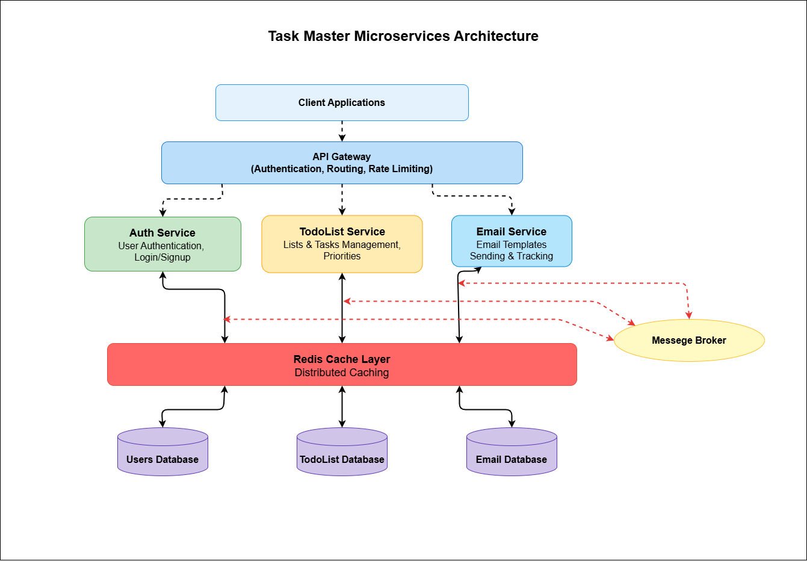

# 🚀 TaskMaster Microservices Platform

[](https://github.com/FayyazAK/TASK_MASTER)
[](LICENSE)
[](https://nodejs.org/)
[](https://expressjs.com/)
[](https://www.mysql.com/)
[](https://redis.io/)

TaskMaster is a production-ready, scalable microservices platform for robust task management. Built with a focus on independent service deployment, fault tolerance, and maintainability, this architecture enables autonomous team development and seamless scaling.

<p align="center">
  
</p>

## ⭐ What Makes TaskMaster Different

TaskMaster's microservices architecture offers significant advantages over traditional monolithic
application
[](https://github.com/FayyazAK/TASK_MASTER)

- **Independent Deployment** - Update services without affecting the entire system
- **Isolated Technology Stacks** - Use the right tools for each service's unique requirements
- **Enhanced Scalability** - Scale individual services based on their specific load
- **Improved Fault Isolation** - Prevent cascading failures with service boundaries
- **Team Autonomy** - Enable parallel development across different services
- **Optimized Resource Utilization** - Allocate resources where they're most needed
- **Accelerated Development Cycles** - Reduce release complexity with smaller codebases
- **Enhanced Security** - Apply granular security policies across service boundaries

## 📐 Architecture Overview

TaskMaster follows a modern microservices architecture pattern with the following key components:

| Service           | Repository                                        | Port | Responsibilities & Key Features                                                   |
| ----------------- | ------------------------------------------------- | ---- | --------------------------------------------------------------------------------- |
| 🔐 Authentication |                                                   | 4001 | User signup/login, JWT generation, role-based access control, password management |
| 🌐 API Gateway    | https://github.com/FayyazAK/taskmaster-ms-gateway | 8000 | Request routing, rate limiting, CORS, security middleware, service discovery      |
| 📝 Todo Service   | https://github.com/FayyazAK/taskmaster-ms-todo    | 4002 | CRUD for lists & tasks, priority management                                       |
| 📧 Email Service  | https://github.com/FayyazAK/taskmaster-ms-email   | 4009 | Email sending, Email Scheduling, Email queue processing (Bull),                   |

### Communication Patterns

- **Synchronous Communication**: REST APIs for direct service-to-service interactions
- **API Gateway**: Centralized entry point for external clients
- **Service Discovery**: Automatic service registration and discovery

## ✨ Features

### 👤 User Management (Authentication Service)

- Secure registration and authentication with JWT
- Bcrypt password hashing with proper salting
- Role-based authorization (admin/regular users)
- User profile management and customization
- Session tracking and management
- Multi-factor authentication support (optional)
- Account recovery workflows

### 🛡️ API Gateway

- Intelligent request routing to appropriate services
- Rate limiting to prevent abuse and DoS attacks
- Request validation and sanitization
- CORS protection with configurable policies
- Circuit breaker patterns for service resilience
- Request/response transformation
- Comprehensive logging and monitoring
- SSL termination and security enforcement

### 📋 Todo Service

- Multi-level organization with lists and tasks hierarchy
- Task prioritization with customizable priority levels
- Due date management with reminders
- Advanced filtering and search capabilities
- Bulk operations for efficient task management
- Redis-based caching for performance optimization
- Real-time updates for collaborative environments
- Task history and audit trails

### 📧 Email Service

- Templated emails for consistent user experience
- Queue-based processing with Bull for reliability
- Scheduled emails
- Email delivery status tracking
- Flexible templating with dynamic content
- HTML and plain text email support

## 🛠️ Technical Stack

### Core Technologies

- **Runtime**: Node.js v18+
- **API Framework**: Express.js 5.x
- **Database**: MySQL 8.0+
- **Caching**: Redis 6.x
- **Queue Management**: Bull
- **API Documentation**: Swagger/OpenAPI

### Security Components

- **Authentication**: JWT (`jsonwebtoken`)
- **Password Hashing**: bcrypt
- **Security Headers**: Helmet
- **Input Validation**: express-validator
- **Rate Limiting**: express-rate-limit

### Operations & Monitoring

- **Process Management**: PM2
- **Logging**: Winston with daily rotation
- **Performance Monitoring**: Optional Prometheus/Grafana integration
- **Health Checks**: Custom health check endpoints for each service
- **Tracing**: Optional OpenTelemetry integration

## 🚀 Getting Started

### Prerequisites

- Node.js v18 or higher
- MySQL 8.0 or higher
- Redis 6.x or higher
- Git

### Local Development Setup

#### 1. Clone the Repositories

```bash
mkdir taskmaster && cd taskmaster

# Clone all required repositories
git clone https://github.com/FayyazAK/taskmaster-ms-auth.git
git clone https://github.com/FayyazAK/taskmaster-ms-gateway.git
git clone https://github.com/FayyazAK/taskmaster-ms-todo.git
git clone https://github.com/FayyazAK/taskmaster-ms-email.git
```

#### 2. Set Up Environment Variables

Create `.env` files in each service directory using the provided templates:

```bash
# Example for Authentication Service
cd taskmaster-ms-auth
cp .env.example .env
# Edit .env file with your specific configuration
```

Repeat for each service directory.

#### 3. Install Dependencies

```bash
# Install dependencies for each service
cd taskmaster-ms-auth
npm install

# Repeat for other services
```

#### 4. Start Services Individually (Development Mode)

```bash
# Start Authentication Service
cd taskmaster-ms-auth
npm run dev

# Repeat for other services in separate terminals
```

### Production Deployment

For production environments:

```bash
# Build optimized packages
cd taskmaster-ms-auth
npm run build

# Start with PM2 for process management
npm run start:prod

# Repeat for other services
```

## 📝 API Documentation

### Authentication Service Endpoints

#### Auth Routes

- `POST /api/auth/signup` - Register a new user
- `POST /api/auth/login` - Login user
- `GET /api/auth/verify` - Email Verification
- `GET /api/auth/current-user` - Get current user info
- `POST /api/auth/logout` - Logout user

#### Admin Routes (admin role required)

- `GET /api/admin/users` - Get all users
- `GET /api/admin/users/:id` - Get user by ID
- `POST /api/admin/users` - Create a new user
- `PUT /api/admin/users/:id` - Update a user
- `DELETE /api/admin/users/:id` - Delete a user

### Todo Service Endpoints

#### Lists

- `GET /api/todo/lists` - Get all lists for user
- `POST /api/todo/lists` - Create a new list
- `GET /api/todo/lists/:list_id` - Get a specific list
- `PUT /api/todo/lists/:list_id` - Update a list
- `DELETE /api/todo/lists/:list_id` - Delete a list
- `DELETE /api/todo/lists/:list_id/clear` - Remove all tasks from a list
- `DELETE /api/todo/lists` - Delete all lists for user
- `DELETE /api/todo/lists/clear` - Clear all tasks from all lists

#### Tasks

- `GET /api/todo/tasks` - Get all tasks for user
- `POST /api/todo/tasks` - Create a new task
- `GET /api/todo/tasks/:task_id` - Get a specific task
- `PUT /api/todo/tasks/:task_id` - Update a task
- `DELETE /api/todo/tasks/:task_id` - Delete a task
- `PUT /api/todo/tasks/:task_id/status` - Update task completion status

#### Priorities

- `GET /api/todo/priorities` - Get all priority levels
- `GET /api/todo/priorities/id/:priority_id` - Get priority by ID
- `GET /api/todo/priorities/level/:level` - Get priority by level

#### Admin Routes (admin role required)

- `POST /api/todo/admin/priorities` - Create a new priority
- `PUT /api/todo/admin/priorities/:id` - Update a priority
- `DELETE /api/todo/admin/priorities/:id` - Delete a priority

### Email Service Endpoints

#### Email Operations

- `POST /api/emails/send` - Send an email
- `GET /api/emails/scheduled` - Get scheduled emails

## 🧠 Caching Strategy

TaskMaster implements a sophisticated Redis caching strategy:

### Cache Implementation

- **Cache-Aside Pattern**: Check cache first, fall back to database
- **Time-Based Expiration**: Configurable TTL for all cached items
- **Strategic Invalidation**: Smart cache clearing using TTL + Write-to-Invalidate
- **Service-Specific Namespaces**: Prevent key collisions across services

## 🔐 Security Considerations

- JWT tokens with appropriate expiration times
- HTTPS enforcement in production
- Parameter validation and sanitization
- Secure password storage with bcrypt
- Rate limiting to prevent brute-force attacks
- Role-based access control
- API key authentication for service-to-service communication
- Secrets management via environment variables

## 🔄 Service Communication

### Direct Communication

- Service-to-service REST API calls for synchronous operations
- Retry policies for transient failures

## 📄 License

This project is licensed under the ISC License - see the [LICENSE](LICENSE) file for details.

## 👥 Contributing

Contributions are welcome! Please feel free to submit pull requests or open issues.

1. Fork the specific service repository
2. Create your feature branch (`git checkout -b feature/amazing-feature`)
3. Commit your changes (`git commit -m 'Add some amazing feature'`)
4. Push to the branch (`git push origin feature/amazing-feature`)
5. Open a Pull Request

## 📧 Contact

For questions or support, please open an issue in the relevant GitHub repository or contact the maintainer directly.

---

Made with ❤️ by Fayyaz AK
